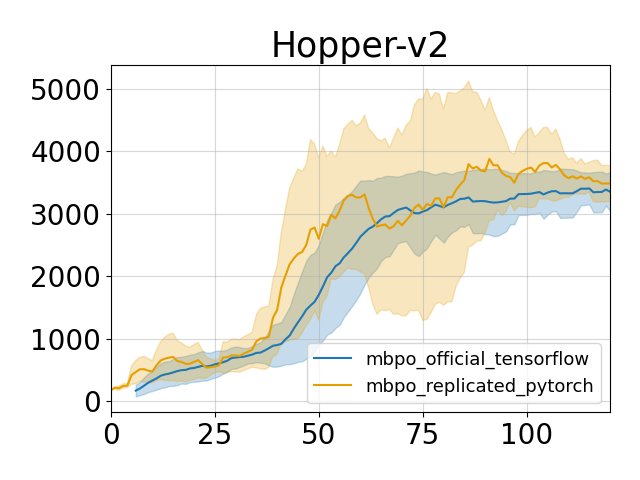
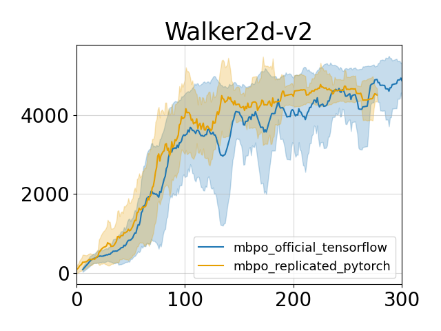

## Overview
This is a re-implementation of the model-based RL algorithm MBPO in pytorch as described in the following paper: [When to Trust Your Model: Model-Based Policy Optimization](https://arxiv.org/abs/1906.08253).

This code is based on a [previous paper in the NeurIPS reproducibility challenge](https://openreview.net/forum?id=rkezvT9f6r) that reproduces the result with a tensorflow ensemble model but shows a significant drop in performance with a pytorch ensemble model. 
This code re-implements the ensemble dynamics model with pytorch and closes the gap. 

## Reproduced results
The comparison are done on two tasks while other tasks are not tested. But on the tested two tasks, the pytorch implementation achieves similar performance compared to the official tensorflow code.
 
## Dependencies

MuJoCo 1.5 & MuJoCo 2.0

## Usage
> python main_mbpo.py --env_name 'Walker2d-v2' --num_epoch 300 --model_type 'pytorch'

> python main_mbpo.py --env_name 'Hopper-v2' --num_epoch 300 --model_type 'pytorch'

## Reference
* Official tensorflow implementation: https://github.com/JannerM/mbpo
* Code to the reproducibility challenge paper: https://github.com/jxu43/replication-mbpo
